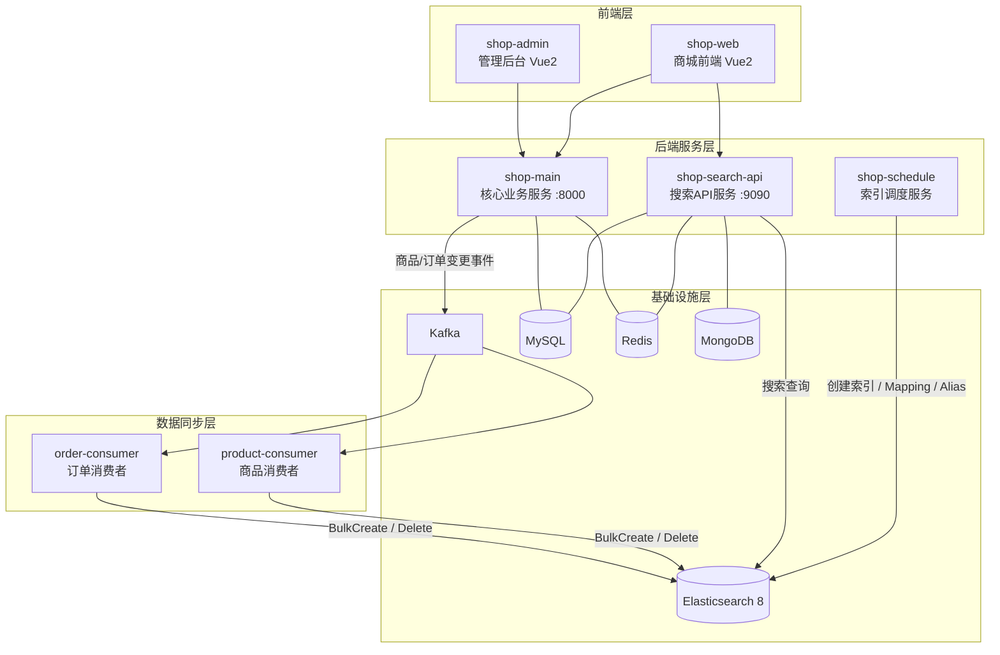
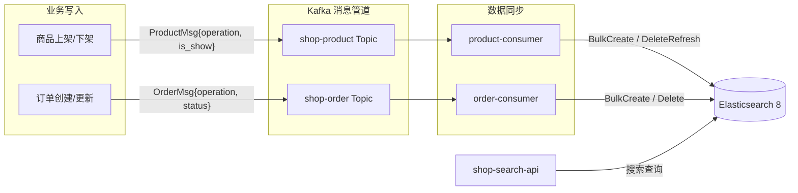

<div align="center">

# Go-Search

**海量数据高并发场景下，基于 Go + Elasticsearch 8 构建的企业级搜索微服务商城系统**

[](https://golang.org)     [](https://www.elastic.co)     [](https://kafka.apache.org)     [](https://www.mysql.com)     [](https://redis.io)     [](https://vuejs.org)     [](LICENSE)

</div>

---

> Go-Search 是一套基于 `Golang` 微服务架构自主研发的现代化电商平台，核心创新在于深度集成 `Elasticsearch 8` 构建高性能企业级搜索引擎。
> 系统采用前后端分离设计（`Vue.js` 前端），通过 `Kafka` 数据管道解耦核心业务与搜索索引同步，利用 `Docker` 容器化实现服务快速部署，包含 **8 个子项目**、提供 **50+ RESTful API**，覆盖从基础设施封装、业务接口、搜索服务、数据同步到前后端展示的 **全链路实现**。

---

## ✨ 项目亮点

<table>
<tr>
<td width="50%">

#### 🏗️ 架构先进性
严格遵循微服务设计原则，服务边界清晰（核心业务、搜索API、索引调度、消费者），具备高内聚、低耦合、独立部署能力

</td>
<td width="50%">

#### 🔍 搜索驱动业务
ES8 不仅用于搜索，更作为核心数据视图，支撑商品展示、订单管理、数据分析等关键场景

</td>
</tr>
<tr>
<td>

#### 📡 近实时数据同步
基于 Kafka + Consumer 模式实现商品/订单数据的增量/全量近实时同步至 ES，保证搜索数据时效性

</td>
<td>

#### ⚡ 高性能批量写入
ES 批量操作基于 BulkProcessor 异步提交，支持自定义 Workers、Flush 间隔和批大小，兼顾吞吐与延迟

</td>
</tr>
<tr>
<td>

#### 📦 基础设施即代码
所有中间件（Redis、MySQL、Kafka、MongoDB）及核心服务均通过 Docker Compose 管理

</td>
<td>

#### 🛠️ 工程化典范
采用 Go 社区推崇的 `project-layout` 标准结构，pkg 公共组件库独立 Module 管理，按需引入

</td>
</tr>
</table>

---

## 🏗️ 系统架构



| 层级 | 组件 | 职责 |
| :--- | :--- | :--- |
| **前端层** | shop-admin / shop-web | Vue2 + Element UI，管理后台与商城界面 |
| **服务层** | shop-main | 商城全部业务 API，Kafka 事件推送，RBAC 权限 |
| **服务层** | shop-search-api | 基于 ES8 的商品/订单高性能搜索接口 |
| **服务层** | shop-schedule | ES 索引生命周期管理（创建、Mapping、Alias） |
| **同步层** | order-consumer / product-consumer | Kafka 消费 → ES 近实时写入（BulkProcessor） |
| **基础设施** | MySQL / Redis / ES8 / Kafka / MongoDB | Docker Compose 统一编排管理 |

---

## 📦 子项目一览

| 项目 | 说明 | 地址 |
| :--- | :--- | :--- |
| **pkg** | 核心基础设施库 — 16 个组件封装（MySQL、Redis、ES、Kafka、MongoDB、HTTP Client、Logger、协程池、优雅关闭等） | [GitHub](https://github.com/HeRedBo/pkg) |
| **shop-main** | 核心业务微服务 — Gin + Gorm + Casbin + JWT，50+ API，RBAC 权限，Kafka 事件推送 | [GitHub](https://github.com/HeRedBo/shop-main) |
| **shop-search-api** | 搜索 API 微服务 — 基于 ES8 的商品搜索与订单搜索 RESTful 接口 | [GitHub](https://github.com/HeRedBo/shop-search-api) |
| **shop-schedule** | 索引调度服务 — ES 索引生命周期管理（创建、Mapping 定义、Alias 切换） | [GitHub](https://github.com/HeRedBo/shop-schedule) |
| **order-consumer** | 订单数据同步消费者 — Kafka 监听订单变更，近实时同步至 ES8 | [GitHub](https://github.com/HeRedBo/order-consumer) |
| **product-consumer** | 商品数据同步消费者 — Kafka 监听商品变更，近实时同步至 ES8 | [GitHub](https://github.com/HeRedBo/product-consumer) |
| **shop-admin** | 管理后台前端 — Vue2 + Element UI，系统/商品/订单管理 | [GitHub](https://github.com/HeRedBo/shop-admin) |
| **shop-web** | 商城前端 — Vue2 + Element UI，商品浏览/搜索/下单 | [GitHub](https://github.com/HeRedBo/shop-web) |

---

## 🧩 项目结构

```
go-search/
├── pkg/                        # 核心基础设施库（16 个独立 Module 组件封装）
│   ├── cache/                  #   Redis 缓存封装
│   ├── db/                     #   MySQL 数据库封装
│   ├── es/                     #   Elasticsearch 封装（BulkProcessor / 索引管理 / 版本控制）
│   ├── mq/                     #   Kafka Producer/Consumer 封装
│   ├── nosql/                  #   MongoDB 封装
│   ├── httpclient/             #   HTTP 客户端封装（重试 / 超时控制）
│   ├── logger/                 #   Zap 日志封装（文件轮转 / 级别分离）
│   ├── routine/                #   协程池
│   ├── shutdown/               #   优雅关闭
│   ├── errors/                 #   统一错误码与堆栈追踪
│   ├── compression/            #   Gzip 压缩封装
│   ├── sign/                   #   接口签名校验
│   ├── strutil/                #   字符串工具
│   ├── timeutil/               #   时间工具
│   ├── trace/                  #   链路追踪
│   └── file/                   #   文件操作
│
├── shop-main/                  # 核心业务微服务（50+ API / RBAC / Kafka 推送）
├── shop-search-api/            # 搜索 API 微服务（ES8 商品/订单搜索）
├── shop-schedule/              # 索引调度服务（索引创建 / Mapping / Alias）
├── order-consumer/             # 订单数据同步消费者（Kafka → ES）
├── product-consumer/           # 商品数据同步消费者（Kafka → ES）
├── shop-admin/                 # 管理后台前端（Vue2 + Element UI）
├── shop-web/                   # 商城前端（Vue2 + Element UI）
└── go-search/                  # 项目说明总入口
```

---

## 🛠️ 技术栈

<table>
<tr><th colspan="3" align="center">后端</th></tr>
<tr><th>分类</th><th>技术</th><th>用途</th></tr>
<tr><td>语言</td><td>Go 1.23</td><td>开发语言</td></tr>
<tr><td>Web 框架</td><td>Gin</td><td>HTTP 路由与中间件</td></tr>
<tr><td>ORM</td><td>Gorm</td><td>数据库操作、关联预加载、软删除</td></tr>
<tr><td>搜索引擎</td><td>Elasticsearch 8</td><td>全文检索、聚合分析、近实时搜索</td></tr>
<tr><td>消息队列</td><td>Kafka (IBM/sarama)</td><td>数据变更事件异步推送、解耦同步</td></tr>
<tr><td>缓存</td><td>Redis (go-redis/v7)</td><td>Token 存储、数据缓存、Bitmap</td></tr>
<tr><td>数据库</td><td>MySQL</td><td>业务数据持久化</td></tr>
<tr><td>文档数据库</td><td>MongoDB</td><td>日志存储、扩展数据</td></tr>
<tr><td>权限</td><td>Casbin v2</td><td>RBAC 角色菜单权限、策略持久化</td></tr>
<tr><td>认证</td><td>JWT</td><td>管理端 & 用户端双 Token 鉴权</td></tr>
<tr><td>日志</td><td>Zap + Lumberjack</td><td>结构化日志、文件轮转</td></tr>
<tr><td>配置</td><td>Viper</td><td>YAML 配置热加载</td></tr>
</table>

<table>
<tr><th colspan="2" align="center">前端</th></tr>
<tr><th>技术</th><th>用途</th></tr>
<tr><td>Vue 2</td><td>前端框架</td></tr>
<tr><td>Element UI</td><td>UI 组件库</td></tr>
<tr><td>Vuex</td><td>状态管理</td></tr>
<tr><td>Vue Router</td><td>路由管理</td></tr>
<tr><td>Axios</td><td>HTTP 请求</td></tr>
<tr><td>ECharts</td><td>数据可视化</td></tr>
</table>

<table>
<tr><th colspan="2" align="center">基础设施</th></tr>
<tr><th>技术</th><th>用途</th></tr>
<tr><td>Docker</td><td>容器化部署</td></tr>
<tr><td>Docker Compose</td><td>服务编排</td></tr>
</table>

---

## 📡 数据流



| 阶段 | 组件 | 操作 |
| :--- | :--- | :--- |
| 业务变更 | shop-main | 商品/订单 CRUD → Kafka SyncProducer 推送消息 |
| 消息管道 | Kafka | shop-product / shop-order 两个 Topic 解耦 |
| 近实时同步 | product-consumer / order-consumer | 根据 operation 类型决定 ES 写入 / 更新 / 删除 |
| 搜索查询 | shop-search-api | Gin 路由 → ES 查询 → 返回结构化结果 |

---

## 🚀 快速开始

### 环境要求

| 依赖 | 版本 |
| :--- | :--- |
| Go | >= 1.23 |
| Node.js | >= 8.9 |
| MySQL | >= 5.7 |
| Redis | >= 4.0 |
| Elasticsearch | 8.x |
| Kafka | 2.x+ |
| MongoDB | 4.x+（可选） |

### 部署步骤

**① 启动基础中间件**

使用 Docker Compose 启动 MySQL、Redis、Elasticsearch、Kafka、MongoDB 等基础服务

> 项目依赖的中间件服务可以通过以下仓库快速搭建：
```bash
# 📦 克隆 docker 环境仓库
git clone https://github.com/HeRedBo/dockers.git
cd dockers

# 🐳 启动基础服务（Elasticsearch、MySQL、Redis、MongoDB、Kafka 等）
docker-compose up -d
```


**② 初始化数据库**

```bash
# 导入 shop-main/sql/ 和 shop-search-api/sql/ 目录下的 SQL 文件
```

**③ 创建 ES 索引**

运行 shop-schedule 服务，或手动通过 `order-consumer/sql/` 和 `product-consumer/sql/` 下的 JSON Mapping 创建索引

**④ 启动后端服务**

```bash
# 核心业务服务
cd shop-main && go mod tidy && go run main.go

# 搜索API服务
cd shop-search-api && go mod tidy && go run main.go

# 订单消费者
cd order-consumer && go mod tidy && go run main.go

# 商品消费者
cd product-consumer && go mod tidy && go run main.go
```

**⑤ 启动前端服务**

```bash
# 管理后台
cd shop-admin && npm install && npm run dev

# 商城前端
cd shop-web && npm install && npm run dev
```

**⑥ 访问系统**

| 服务 | 地址 | 说明 |
| :--- | :--- | :--- |
| 管理后台 | http://localhost:9528 | 账号：admin / 123456 |
| 商城前端 | http://localhost:8080 | 面向用户 |
| 核心 API | http://localhost:8000 | shop-main |
| 搜索 API | http://localhost:9090 | shop-search-api |

---

<div align="center">

**Apache-2.0** License

</div>
